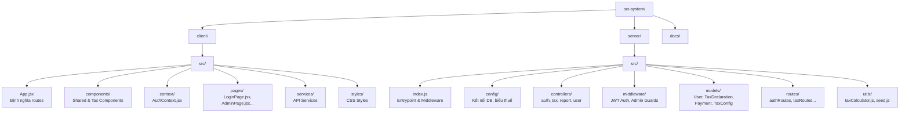
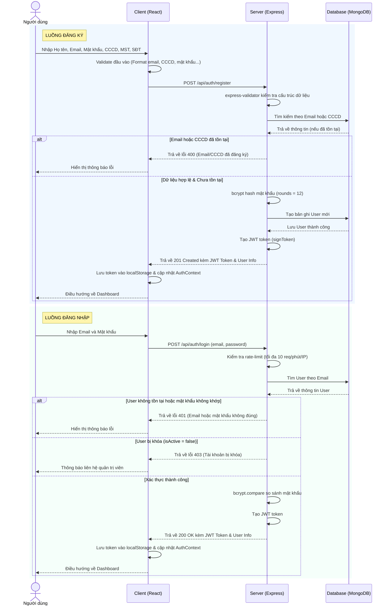
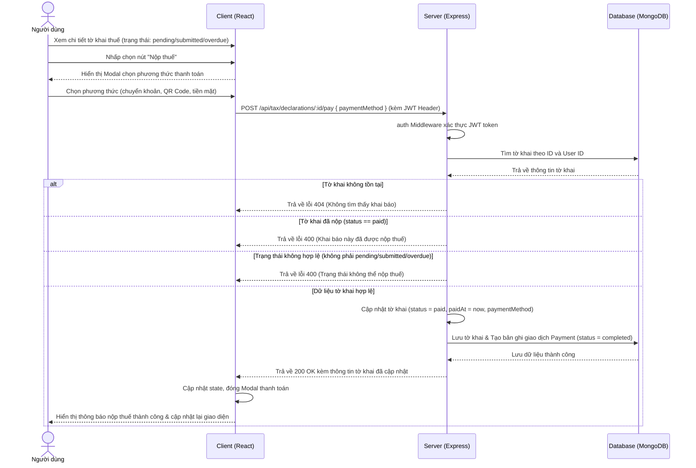

# TaxVN — Hệ Thống Quản Lý Thuế Thu Nhập Cá Nhân

Hệ thống khai báo và quản lý thuế thu nhập cá nhân (TNCN) trực tuyến theo pháp luật Việt Nam.

Mã nguồn ứng dụng nằm trong thư mục [`tax-system/`](./tax-system).

## Tính năng

### Người dùng
| Tính năng | Mô tả |
|-----------|-------|
| Đăng ký / Đăng nhập | Xác thực JWT, validate ở cả client và server |
| Máy tính thuế | Tính thuế lũy tiến tức thì, hiển thị chi tiết từng bậc |
| Khai báo thuế | Form động nhiều nguồn thu nhập và nhiều loại giảm trừ |
| Nộp thuế | Modal 3 bước với 4 phương thức thanh toán |
| Lịch sử khai báo | Lọc theo trạng thái/năm, xem chi tiết |
| Báo cáo cá nhân | Biểu đồ Recharts (AreaChart + BarChart), tải PDF |
| Hồ sơ cá nhân | Cập nhật thông tin và đổi mật khẩu |

### Quản trị viên
| Tính năng | Mô tả |
|-----------|-------|
| Quản lý người dùng | Danh sách, tìm kiếm, khóa/mở khóa tài khoản |
| Quản lý tờ khai | Xem toàn bộ hệ thống, lọc theo trạng thái/năm |
| Xuất Excel | Tải danh sách tờ khai dạng .xlsx |
| Thống kê hệ thống | Tổng user, khai báo, doanh thu; biểu đồ theo năm |
| Cấu hình biểu thuế | Chỉnh mức giảm trừ và bậc thuế suất theo năm |

## Công nghệ

| Tầng | Công nghệ |
|------|-----------|
| Frontend | React 18 (JSX), React Router v6, Recharts |
| Styling | Vanilla CSS (không framework) |
| Backend | Node.js, Express.js |
| Database | MongoDB, Mongoose |
| Auth | JWT + bcryptjs |
| Bảo mật | Helmet, CORS, express-rate-limit, express-validator |
| Export | xlsx, pdfkit |

## Cài đặt & Chạy local

### Yêu cầu
- Node.js >= 18.x
- MongoDB >= 6.x (chạy local hoặc dùng MongoDB Atlas)
- npm >= 9.x

### Các bước

```bash
# 1. Clone project
git clone https://github.com/tathanhphu4/Thue_TNCN.git
cd Thue_TNCN/tax-system

# 2. Cài đặt tất cả dependencies
npm run install:all

# 3. Cấu hình backend
cd server
cp .env.example .env
# Mở .env và chỉnh sửa MONGODB_URI, JWT_SECRET (chuỗi ngẫu nhiên >= 32 ký tự)
cd ..

# 4. Tạo dữ liệu mẫu (admin + user mẫu + biểu thuế)
node server/src/utils/seed.js

# 5. Chạy hệ thống (client + server)
npm run dev
```

**URLs:**
- Frontend: http://localhost:3000
- Backend API: http://localhost:5000/api
- Health check: http://localhost:5000/api/health

### Tài khoản mẫu

| Role | Email | Mật khẩu |
|------|-------|----------|
| Admin | admin@taxvn.com | Admin@123 |
| User | user@taxvn.com | User@123 |

## Lệnh tiện ích

```bash
npm run dev            # Chạy cả client + server (development)
npm run server         # Chỉ chạy server
npm run client         # Chỉ chạy client
npm run install:all    # Cài tất cả packages
node server/src/utils/seed.js   # Tạo dữ liệu mẫu
cd client && npm run build      # Build production client
```

## Deploy lên Production

### Backend (Render / Railway)
1. Kết nối GitHub repo với Render/Railway, chọn root là `tax-system/`.
2. Environment Variables:
   ```
   NODE_ENV=production
   PORT=5000
   MONGODB_URI=mongodb+srv://<user>:<pass>@cluster.mongodb.net/tax_system
   JWT_SECRET=<strong-random-secret>
   ALLOWED_ORIGINS=https://your-frontend.vercel.app
   ```
3. Build command: `npm run install:all`
4. Start command: `node server/src/index.js`

### Frontend (Vercel / Netlify)
1. Import repo, root directory: `tax-system/client`.
2. Build command: `npm run build`, output dir: `build`.
3. Environment Variable: `REACT_APP_API_URL=https://your-backend.onrender.com/api`
4. Cấu hình SPA rewrites: `/* -> /index.html`

## Cấu trúc thư mục

### Sơ đồ cấu trúc thư mục



### Chi tiết tệp tin
```
tax-system/
├── package.json            # Root: concurrently chạy cả 2 service
├── client/                 # Frontend (React 18)
│   ├── package.json
│   ├── public/
│   └── src/
│       ├── App.jsx         # Router + route definitions
│       ├── index.jsx       # Entry point
│       ├── context/
│       │   └── AuthContext.jsx  # Global auth state (JWT)
│       ├── components/
│       │   └── shared/     # PrivateRoute, AdminRoute, ErrorBoundary
│       ├── pages/
│       │   ├── LoginPage.jsx
│       │   ├── RegisterPage.jsx
│       │   ├── DashboardPage.jsx
│       │   ├── TaxCalculatorPage.jsx
│       │   ├── TaxDeclarePage.jsx
│       │   ├── TaxHistoryPage.jsx
│       │   ├── ProfilePage.jsx
│       │   ├── ReportPage.jsx
│       │   └── AdminPage.jsx
│       ├── services/       # API calls (axios)
│       ├── hooks/          # Custom React hooks
│       ├── styles/         # CSS modules
│       └── utils/          # Helpers
│
└── server/                 # Backend (Node.js + Express)
    ├── package.json
    ├── .env
    └── src/
        ├── index.js        # Entry point + middleware + routes
        ├── config/
        │   └── taxRules.js # Biểu thuế TNCN Việt Nam
        ├── controllers/
        │   ├── authController.js
        │   ├── taxController.js
        │   ├── reportController.js
        │   └── userController.js
        ├── middleware/
        │   └── auth.js     # JWT verify, adminOnly guard
        ├── models/
        │   ├── User.js
        │   ├── TaxDeclaration.js
        │   ├── Payment.js
        │   └── TaxConfig.js
        ├── routes/
        │   ├── authRoutes.js
        │   ├── taxRoutes.js
        │   ├── reportRoutes.js
        │   ├── userRoutes.js
        │   └── configRoutes.js
        └── utils/
            ├── taxCalculator.js  # Logic tính thuế lũy tiến
            └── seed.js           # Seed data mẫu

```

## Sơ đồ luồng hoạt động

### 1. Luồng Đăng nhập & Đăng ký



### 2. Luồng Nộp thuế



## Biểu thuế TNCN

Biểu thuế lũy tiến từng phần (theo thu nhập tính thuế/tháng):

| Bậc | Thu nhập tính thuế/tháng | Thuế suất |
|-----|--------------------------|-----------|
| 1 | Đến 5 triệu | 5% |
| 2 | Trên 5 đến 10 triệu | 10% |
| 3 | Trên 10 đến 18 triệu | 15% |
| 4 | Trên 18 đến 32 triệu | 20% |
| 5 | Trên 32 đến 52 triệu | 25% |
| 6 | Trên 52 đến 80 triệu | 30% |
| 7 | Trên 80 triệu | 35% |

**Giảm trừ gia cảnh:** Bản thân 11.000.000 VNĐ/tháng | Người phụ thuộc 4.400.000 VNĐ/tháng/người

> Biểu thuế và mức giảm trừ có thể cấu hình động theo từng năm qua Admin Panel.

## Tài liệu

- [API Documentation](./tax-system/docs/API.md)
- [System Workflow](./tax-system/docs/WORKFLOW.md)
